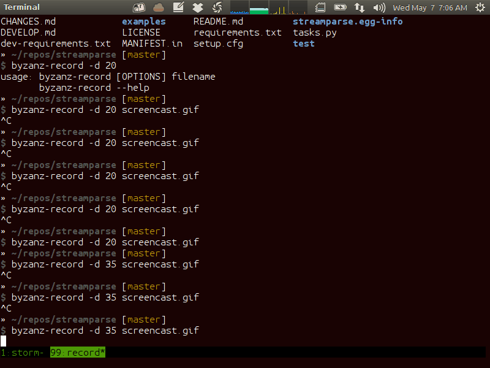

=======================
streamparse and pystorm
=======================

*Simple, Reliable Parallel Processing with Storm*

Dan Blanchard |br|
Backend Software Engineer @ Parse.ly

.. rst-class:: logo

    .. image:: ./_static/parsely.png
        :width: 40%
        :align: right

.. |br| raw:: html

     

Python GIL
==========

Python's GIL does not allow true multi-thread parallelism:

.. image:: _static/python_gil_new.png
    :align: center
    :width: 80%

And on multi-core, it even leads to lock contention:

.. image:: _static/python_gil.png
    :align: center
    :width: 80%

`@amontalenti`_ discussed this in more detail this afternoon

.. _@amontalenti: http://twitter.com/amontalenti

Queues and workers
==================

.. rst-class:: spaced

    .. image:: /_static/queues_and_workers.png
        :width: 70%
        :align: center

Standard way to solve GIL woes.

**Queues**: ZeroMQ => Redis => RabbitMQ

**Workers**: Cron Jobs => RQ => Celery

Parse.ly Architecture, 2012
===========================

.. image:: /_static/tech_stack.png
    :width: 90%
    :align: center

It started to get messy
=======================

.. image:: ./_static/monitors.jpg
    :width: 90%
    :align: center

What is this Storm thing?
=========================

We read:

"Storm is a **distributed real-time computation system**."

Dramatically simplifies your workers and queues.

"Great," we thought. "But, what about Python support?"

That's what streamparse is about.

==================
Our Storm Use Case
==================

What is Parse.ly?
=================

Web content analytics for digital storytellers.

Some of our customers:

.. image:: ./_static/parsely_customers.png
    :width: 98%
    :align: center

Elegant data dashboards
=======================

Informing thousands of editors and writers every day:

Powerful data APIs
==================

Powering billions of site visits every month:

.. image:: ./_static/newyorker_related.png
    :width: 98%
    :align: center

Too many datas!
===============

.. image:: ./_static/sparklines_multiple.png
    :width: 90%
    :align: center

"Python Can't Do This"
======================

"Free lunch is over."

"It can't scale."

"It's a toy language."

**"Shoulda used Scala."**

Python Can't Scale?
===================

Eat that, haters!

.. image:: ./_static/cpu_cores.png
    :width: 90%
    :align: center

Thanks to Storm
===============

.. image:: ./_static/storm_applied.png
    :width: 90%
    :align: center

streamparse is Pythonic Storm
=============================

.. image:: ./_static/streamparse_logo.png

streamparse lets you parse real-time streams of data.

It smoothly integrates Python code with Apache Storm.

Easy quickstart, good CLI/tooling, production tested.

Good for: Analytics, Logs, Sensors, Low-Latency Stuff.

Agenda
======

* Storm topology concepts
* Storm internals
* How does Python work with Storm?
* streamparse overview
* Coming soon

Slides on web

- Slides: http://parse.ly/slides/pystorm2015
- Notes: http://parse.ly/slides/pystorm2015/notes

=======================
Storm Topology Concepts
=======================

Storm Abstractions
==================

Storm provides abstractions for data processing:

- Tuple
- Spout
- Bolt
- Topology

Wired Topology
==============

.. rst-class:: spaced

    .. image:: ./_static/topology.png
        :width: 80%
        :align: center

Tuple
=====

A single data record that flows through your cluster.

.. sourcecode:: python

    # tuple spec: ["word"]
    word = ("dog",)
    # tuple spec: ["word", "count"]
    word_count = ("dog", 4)

Word Stream Spout in Python
===========================

A component that emits raw data into cluster.

.. sourcecode:: python

    import itertools

    from streamparse.spout import Spout

    class Words(Spout):

        def initialize(self, conf, ctx):
            self.words = itertools.cycle(['dog', 'cat',
                                          'zebra', 'elephant'])

        def next_tuple(self):
            word = next(self.words)
            self.emit([word])

Emits one-word tuples from endless generator.

Word Count Bolt in Python
=========================

A component that performs an operation on tuples.

.. sourcecode:: python

    from collections import Counter

    from streamparse.bolt import Bolt

    class WordCount(Bolt):

        def initialize(self, conf, ctx):
            self.counts = Counter()

        def process(self, tup):
            word = tup.values.word
            self.counts[word] += 1
            self.logger.info('%s: %d', word, self.counts[word])

Keeps word counts in-memory (assumes grouping).

Topology
========

Directed Acyclic Graph (DAG) describing it all.

.. sourcecode:: python

    class WordCountTopology(Topology):
        word_spout = WordSpout.spec(par=2)
        word_count_bolt = WordCountBolt.spec(inputs=[word_spout], par=8)

===============
Storm Internals
===============

Tuple Tree
==========

.. rst-class:: spaced

    .. image:: ./_static/wordcount.png
        :width: 70%
        :align: center

Streams, Grouping and Parallelism
=================================

================ ================= =======================
X                word-spout        word-count-bolt
================ ================= =======================
input            None              word-spout
output           word-count-bolt   None
tuple            ``("dog",)``      ``("dog", 4)``
stream           ``["word"]``      ``["word", "count"]``
grouping         ``["word"]``      ``":shuffle"``
parallelism      2                 8
================ ================= =======================

Nimbus and Storm UI
===================

.. rst-class:: spaced

    .. image:: ./_static/storm_ui.png
        :width: 98%
        :align: center

Workers and Zookeeper
=====================

.. rst-class:: spaced

    .. image:: ./_static/storm_cluster.png
        :width: 80%
        :align: center

Empty Slots
===========

.. rst-class:: spaced

    .. image:: ./_static/storm_slots_empty.png
        :width: 90%
        :align: center

Filled Slots and Rebalancing
============================

.. rst-class:: spaced

    .. image:: ./_static/storm_slots_filled.png
        :width: 90%
        :align: center

BTW, Buy This Book!
===================

Source of these diagrams.

**Storm Applied**, by Manning Press.

Reviewed in `Storm, The Big Reference`_.

.. image:: ./_static/storm_applied.png
    :width: 50%
    :align: center

.. _Storm, The Big Reference: http://blog.parsely.com/post/1271/storm/

Network Transfer
================

.. rst-class:: spaced

    .. image:: ./_static/storm_transfer.png
        :width: 90%
        :align: center

So, Storm is Sorta Amazing!
===========================

Storm...

- will **guarantee processing** via tuple trees
- does **tuneable parallelism** per component
- implements a **high availability** model
- allocates **Python process slots** on physical nodes
- helps us **rebalance computation** across cluster
- handles **network messaging automatically**

And, it **beats the GIL**!

Let's Do This!
==============

.. image:: ./_static/cpu_cores.png
    :width: 90%
    :align: center

=======================
Getting Python on Storm
=======================

Multi-Lang Protocol (1)
=======================

Storm supports Python through the **multi-lang protocol**.

- JSON protocol
- Works via shell-based components
- Communicate over ``STDIN`` and ``STDOUT``

Clean, UNIX-y.

Can use CPython, PyPy; no need for Jython or Py4J.

Kinda quirky, but also relatively simple to implement.

Multi-Lang Protocol (2)
=======================

Each component of a "Python" Storm topology is either:

- ``ShellSpout``
- ``ShellBolt``

Java implementations speak to Python via light JSON.

There's **one sub-process per Storm task**.

If ``p = 8``, then **8 Python processes** are spawned.

Multi-Lang Protocol (3)
=======================

Handshake sends config and context to Python process.

Heartbeats make sure subprocesses aren't stuck.

storm.py issues
===============

Storm bundles "storm.py" (a multi-lang implementation).

But, it's not Pythonic or reliable.

We'll fix that, we thought!

Storm as Infrastructure
=======================

Thought: Storm should be like Cassandra/Elasticsearch.

"Written in Java, but Pythonic nonetheless."

Need: Python as a **first-class citizen**.

Must also fix packing unpleasantness..

====================
streamparse overview
====================

Enter streamparse
=================

Initial release Apr 2014; over a year of active development.

800+ stars `on Github`_, was a trending repo in May 2014.

90+ mailing list members and 13 new `committers`_.

3 Parse.ly engineers maintaining it.

Funding `from DARPA`_.

.. _committers: https://github.com/Parsely/streamparse/graphs/contributors
.. _on Github: https://github.com/Parsely/streamparse
.. _from DARPA: http://www.fastcompany.com/3040363/the-future-of-search-brought-to-you-by-the-pentagon

Splitting off pystorm
=====================

After the release of streamparse, Yelp released `pyleus`_.

Multi-Lang implementation essentially the same as streamparse's.

Why not just have one Python implementation of Multi-Lang?

.. _pyleus: https://github.com/Yelp/pyleus

Enter pystorm
=============

Took streamparse's storm package, added Yelp's serialization code.

`No response from Yelp`_ yet, but we have high hopes.

Plan to request that Apache Storm just points to pystorm instead of storm.py.

.. _No response from Yelp: https://github.com/Yelp/pyleus/issues/158

streamparse CLI
===============

``sparse`` provides a CLI front-end to ``streamparse``, a framework for
creating Python projects for running, debugging, and submitting Storm
topologies for data processing.

After installing the ``lein`` (only dependency), you can run::

    pip install streamparse

This will offer a command-line tool, ``sparse``. Use::

    sparse quickstart

Running and debugging
=====================

You can then run the local Storm topology using::

    $ sparse run
    Running wordcount topology...
    Options: {:spec "topologies/wordcount.clj", ...}
    #<StormTopology StormTopology(spouts:{word-spout=...
    storm.daemon.nimbus - Starting Nimbus with conf {...
    storm.daemon.supervisor - Starting supervisor with id 4960ac74...
    storm.daemon.nimbus - Received topology submission with conf {...
    ... lots of output as topology runs...

GIF Demo
========

Submitting to remote cluster
============================

**Single command**::

    $ sparse submit

Does all the following **magic**:

    - Makes virtualenvs across cluster (optional)
    - Builds a JAR out of your source code
    - Opens reverse tunnel to Nimbus
    - Constructs an in-memory Topology spec
    - Uploads JAR to Nimbus

streamparse supplants storm.py
==============================

.. image:: _static/streamparse_comp.png
    :align: center
    :width: 80%

==========================
Making our topology faster
==========================

BatchingBolt for Performance
============================

.. sourcecode:: python

    from streamparse.bolt import BatchingBolt

    class WordCount(BatchingBolt):
        config = {'topology.tick.tuple.freq.secs': 1}
        ticks_between_batches = 5

        def group_key(self, tup):
            # collect batches of words
            word = tup.values.word
            return word

        def process_batch(self, key, tups):
            # emit the count of words we had per 5s batch
            self.emit([key, len(tups)])

Implements **5-second micro-batches** via tick tuples.

Bolts for Real-Time ETL
=======================

.. rst-class:: spaced

    .. image:: ./_static/storm_data.png
        :width: 80%
        :align: center

streamparse config.json
=======================

.. sourcecode:: javascript

    {
        "envs": {
            "0.8": {
                "user": "ubuntu",
                "nimbus": "storm-head.ec2-ubuntu.com",
                "workers": ["storm1.ec2-ubuntu.com",
                            "storm2.ec2-ubuntu.com"],
                "log_path": "/var/log/ubuntu/storm",
                "virtualenv_root": "/data/virtualenvs"
            },
            "vagrant": {
                "user": "ubuntu",
                "nimbus": "vagrant.local",
                "workers": ["vagrant.local"],
                "log_path": "/home/ubuntu/storm/logs",
                "virtualenv_root": "/home/ubuntu/virtualenvs"
            }
        }
    }

sparse options
==============

.. sourcecode:: text

    $ sparse --help
    usage: sparse [-h] [--version]
                  {jar,kill,list,quickstart,remove_logs,run,stats,submit,
                   tail,update_virtualenv,visualize,worker_uptime}
                  ...

    Utilities for managing Storm/streamparse topologies.

    sub-commands:
        jar                 Create a deployable JAR for a topology.
        kill                Kill the specified Storm topology
        list                List the currently running Storm topologies
        quickstart          Create new streamparse project template.
        remove_logs         Remove logs from Storm workers.
        run                 Run the local topology with the given args
        stats               Display stats about running Storm topologies.
        submit              Submit a Storm topology to Nimbus.
        tail                Tail logs for specified Storm topology.
        update_virtualenv   Create/update a virtualenv on Storm workers.
        worker_uptime       Display uptime for Storm workers.

===========
Coming soon
===========

Simpler Deployment
==================

Currently we create virtualenvs via SSH/fabric.

This doesn't work with Docker.

Will setup virtualenvs when topology starts running on cluster.

Will be accomplished via topology hook.

Python Topology DSL
===================

Was shown in talk as if finished, but not available in a release.

Follow the `pull request`_ for updates.

.. _pull request: https://github.com/Parsely/streamparse/pull/199

Remove all traces of Clojure
============================

Previously used Leiningen for packaging and Clojure for DSL.

Will switch to communicating with Nimbus directly via Thrift.

`thriftpy`_ makes this very simple.

.. _thriftpy: https://github.com/eleme/thriftpy

Questions?
==========

streamparse: http://github.com/Parsely/streamparse

pystorm: http://github.com/pystorm/pystorm

Parse.ly's hiring: http://parse.ly/jobs

Find me on Twitter: http://twitter.com/dsblanch

That's it!

.. raw:: html

    

.. ifnotslides::

    .. raw:: html

        

.. ifslides::

    .. raw:: html

        
